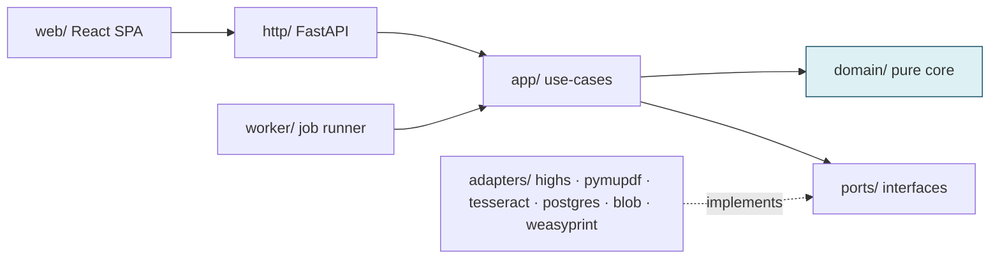
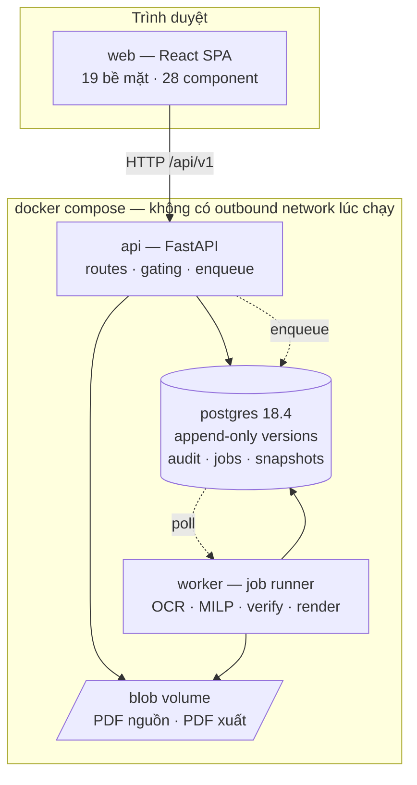
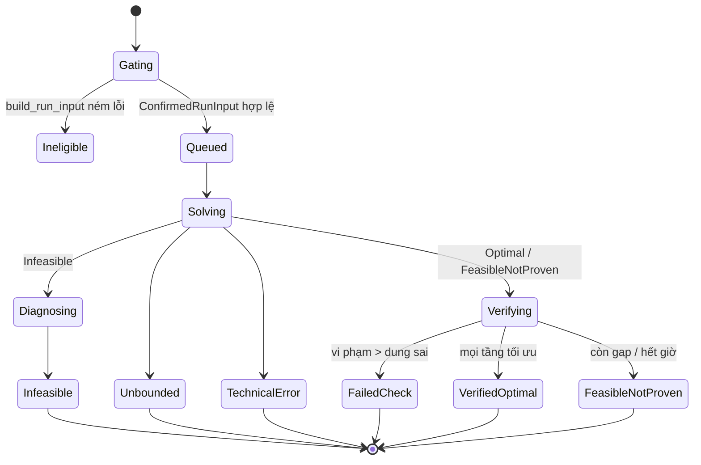
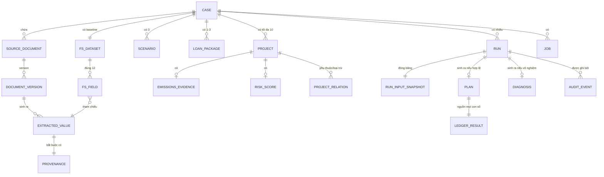

# Architecture Spine — FinESG Planner

## Design Paradigm

**Hexagonal (ports & adapters) quanh một deterministic pure-function core.**

Sản phẩm này sống hay chết ở một câu hỏi: *cùng đầu vào có cho cùng con số không, và con số đó có kiểm chứng được không.* Paradigm được chọn vì nó tách hẳn phần phải tái lập 100% (công thức, mô hình, verifier) khỏi phần bản chất là bẩn và không tái lập (OCR, DB, HiGHS, thời gian, filesystem).

| Lớp hexagon | Namespace | Nội dung |
|---|---|---|
| Core (thuần, không I/O) | `api/src/finesg/domain/` | Model dữ liệu, hợp đồng tính toán §4.3.1, model builder MILP, verifier, rubric rủi ro, readiness/eligibility |
| Ports (interface) | `api/src/finesg/ports/` | `SolverPort`, `ExtractorPort`, `OcrPort`, `RepositoryPort`, `RendererPort`, `ClockPort` |
| Adapters (bẩn) | `api/src/finesg/adapters/` | `highs/`, `pymupdf/`, `tesseract/`, `postgres/`, `weasyprint/` |
| Driving side | `api/src/finesg/http/`, `api/src/finesg/worker/` | FastAPI routes, job worker |
| UI | `web/src/` | React SPA, chỉ nói chuyện với hexagon qua HTTP |

Không có `[ASSUMPTION]` ở tầng paradigm: PRD NFR-4/5/6/7 đã ép sẵn hình dạng này.

## Invariants & Rules

### Hướng phụ thuộc



Mũi tên đặc là `import` được phép. `domain/` không có mũi tên đi ra — đó là luật, không phải mô tả. `adapters/` chỉ được `import` từ `ports/` và `domain/` (kiểu dữ liệu), không bao giờ ngược lại.

### AD-1 — Core thuần, zero I/O, zero nondeterminism

- **Binds:** `all`; NFR-4, NFR-6, NFR-7
- **Prevents:** một công thức lén đọc DB, đồng hồ hệ thống, biến môi trường hoặc RNG giữa chừng, làm cùng đầu vào ra hai kết quả khác nhau và phá vỡ golden test.
- **Rule:** `domain/**` không được `import` bất cứ thứ gì từ `adapters/**`, `http/**`, `worker/**`, `sqlalchemy`, `os`, `random`, `datetime.now`/`utcnow`, `time`. Mọi đầu vào đến dưới dạng frozen Pydantic model được truyền vào; thời điểm đến từ `ClockPort` do caller inject. Luật này được kiểm tra bằng một test tĩnh `test_domain_purity.py` chạy trong CI, không phải bằng code review.

### AD-2 — Verifier ledger là nguồn duy nhất của mọi con số tài chính hiển thị

- **Binds:** FR-11, FR-17, FR-21, FR-23, FR-24, FR-26; NFR-5, NFR-8
- **Prevents:** dashboard, Gói bằng chứng PDF, API và bộ giải mỗi bên tự tính DSCR/CashEnd12 một kiểu, rồi cùng một Phương án hiện bốn con số lệch nhau.
- **Rule:** `domain/verify/ledger.py` sinh ra một `LedgerResult` chứa toàn bộ đại lượng §4.3.1 theo từng tháng. Mọi bề mặt hiển thị (S15, S16, S18, PDF) chỉ đọc từ `LedgerResult` đã persist. Đầu ra của HiGHS đi vào một kiểu riêng `SolverMeta` chỉ có `solver_status`, `mip_gap`, `tier_objective_values`, `solve_seconds`, `seed`, `threads`, `time_limit`, `big_m` — **kiểu này không có field tiền hay CO₂ nào**, nên render một con số nghiệp vụ từ bộ giải đòi hỏi phải bịa thêm field, và điều đó lộ ra khi review.

### AD-3 — Solver coefficients và verifier ledger là hai hiện thực độc lập

- **Binds:** FR-17, FR-21; NFR-4, NFR-5, NFR-6
- **Prevents:** một lỗi trong bước tiền tính hệ số (`DebtServiceCoef_k,t`, `DrawdownShare_k,t`, `PrincipalPaidCoef12`, `FinancingCostCoefPV`, `FixedCashFee_k,t`, `FixedFeePV`) trở nên vô hình vì cả bộ giải lẫn bộ kiểm tra đều dùng chung nó — đúng cái mà "Bộ kiểm tra nghiệm độc lập" tồn tại để bắt.
- **Rule:** `domain/verify/**` bị cấm `import` `domain/solve/coefficients.py` và bị cấm đọc bất kỳ tổng trung gian nào từ `SolverPort`. Verifier đi bộ từng tháng `t = 1..12` trực tiếp từ lịch Gói vay đã xác nhận cộng vector nghiệm `(x, u, d, y)`. Biến `h` đến từ nghiệm nhưng verifier **tự suy lại** `h` theo quy tắc FR-17 (nợ hiện hữu > 0, hoặc có Gói vay được chọn với nghĩa vụ nợ 12 tháng dương; ân hạn toàn phần không làm `h=1`) và khẳng định hai giá trị khớp — nếu không, `h` do big-M lệch sẽ cho một nghiệm né được ràng buộc DSCR mà verifier vẫn thông qua. Golden test khẳng định hai đường tính ra cùng kết quả trong `τ_feasibility`; hai đường lệch nhau là **fail build**, không phải cảnh báo.

### AD-4 — Tiền và CO₂ là `Decimal`, không bao giờ là `float`

- **Binds:** FR-11, FR-17, FR-21; NFR-8; SM-C5
- **Prevents:** sai số nhị phân làm một nghiệm vi phạm ngưỡng trông như hợp lệ, hoặc `0.1 + 0.2 ≠ 0.3` làm cân bằng vốn lệch.
- **Rule:** mọi đại lượng tiền/CO₂ trong `domain/` và trong DB là `Decimal` với ít nhất 6 chữ số thập phân của đơn vị chuẩn hóa (cột `NUMERIC(28,6)`). `float` chỉ tồn tại bên trong adapter HiGHS; hai chiều qua biên đi qua đúng hai hàm `to_solver_float()` / `from_solver_float()`. Kiểm tra ràng buộc dùng giá trị **chưa** làm tròn; làm tròn hiển thị là một hàm riêng ở tầng presentation và không bao giờ được gọi trong `domain/`.

### AD-5 — `None` không bao giờ tự biến thành `0`

- **Binds:** FR-4, FR-6, FR-7, FR-12; §4.3.1 quy ước dữ liệu
- **Prevents:** một Trường BCTC không đọc được lặng lẽ thành 0, và hệ thống trả về một phân tích trông hoàn chỉnh nhưng sai toàn bộ — rủi ro số 1 trong bảng §13 của PRD.
- **Rule:** giá trị thiếu là `None` trong model và `NULL` trong DB. Phép toán chạm vào `None` ném `MissingInputError` kèm mã trường; không có `or 0`, không `getattr(..., 0)`, không `COALESCE` trên cột số nghiệp vụ. Lint rule chặn `or 0` trong `domain/`.

### AD-6 — Một cổng duy nhất dựng `ConfirmedRunInput`

- **Binds:** FR-2, FR-6, FR-9, FR-12, FR-14, FR-16, FR-17
- **Prevents:** dữ liệu chưa xác nhận rò vào một lần chạy qua một đường vòng nào đó — mỗi call-site tự kiểm tra một tập điều kiện khác nhau.
- **Rule:** `SolverPort` và verifier chỉ nhận kiểu `ConfirmedRunInput`. Kiểu này chỉ được dựng bởi `domain/gating/build_run_input.py`, hàm này ném `IneligibleRunError` (kèm danh sách lý do có mã) trừ khi mọi đối tượng bắt buộc đang ở trạng thái `CONFIRMED` tại đúng version đã pin. Chế độ Sàng lọc mô phỏng là **một trường** `output_kind` trên chính kiểu đó, không phải một đường vòng qua cổng.

### AD-7 — Overlap CO₂ được giải quyết trước bộ giải, không nằm trong hàm mục tiêu

- **Binds:** FR-13, FR-14, FR-19, FR-20; §14 tiêu chí 17
- **Prevents:** hai Dự án chia nhau một vùng phát thải cùng được chọn và CO₂ bị cộng trùng — greenwashing do lỗi mô hình.
- **Rule:** mỗi Phiếu bằng chứng mang `overlap_group_id` nullable. `build_run_input` ném lỗi nếu hai Dự án đủ điều kiện cùng `overlap_group_id` mà không có quan hệ `MUTUALLY_EXCLUSIVE` giữa chúng. Bộ giải không bao giờ nhìn thấy một cấu hình có thể cộng trùng.

### AD-8 — `Provenance` là thành phần bắt buộc của mọi giá trị trích xuất

- **Binds:** FR-4, FR-5, FR-6, FR-26, FR-27; NFR-9
- **Prevents:** một con số tồn tại trong hệ thống mà không ai truy được nó đến từ đâu — vi phạm nguyên tắc sản phẩm số 1.
- **Rule:** `ExtractedValue` không thể khởi tạo nếu thiếu `Provenance(document_version_id, page, bbox, raw_text, method, confidence)`. Nhập tay dùng `method=MANUAL` với `page=None, bbox=None` nhưng `Provenance` vẫn tồn tại — không có nhánh nào cho `provenance=None`. `bbox` được chuẩn hóa tại biên adapter về **đúng một không gian tọa độ**: gốc trên-trái, đơn vị phân số `[0,1]` của kích thước trang đã xoay. Chọn công cụ trích bảng là chuyện của code (xem Deferred), nhưng không gian tọa độ thì không — hai extractor trả bbox theo hai hệ khác nhau sẽ khiến CMP-06 vẽ khung sai chỗ, và Provenance là tuyên bố cốt lõi của sản phẩm.

### AD-9 — Chiến lược là dữ liệu, không phải nhánh code

- **Binds:** FR-18, FR-19, FR-20, FR-22; NFR-7
- **Prevents:** ba Chiến lược trôi khỏi nhau về cách khóa tầng, dung sai và phá hòa vì mỗi cái có một hàm `solve_safe()` / `solve_balanced()` riêng.
- **Rule:** một `Strategy` là một list có thứ tự của `Tier(sense, objective_key)` khai báo trong `domain/solve/strategies.py`. Một vòng lặp giải **duy nhất** thực thi mọi tier list và sau mỗi tầng áp `z ≥ z* − τ(z*)` (tối đa hóa) hoặc `z ≤ z* + τ(z*)` (tối thiểu hóa) với `τ(z*) = max(1e-6, 1e-8·|z*|)`. Không có `if strategy == ...` trong vòng lặp giải. Chuỗi phá hòa cuối cùng — tối thiểu hóa lần lượt `x_i`, `y_k`, `u_i`, `d_ik` theo mã ổn định — là các tier bắt buộc được append vào mọi Strategy, không phải bước hậu xử lý.

### AD-10 — Thứ tự ổn định trước khi dựng model

- **Binds:** FR-17, FR-18..FR-22; NFR-7; SM-C5
- **Prevents:** hai lần chạy giống hệt trả hai Phương án tương đương nhưng khác nhau vì thứ tự dict/set thay đổi giữa các process.
- **Rule:** Dự án và Gói vay được sort theo `code` (so sánh chuỗi ASCII, không phụ thuộc locale) ngay khi vào `build_run_input`, trước mọi thao tác dựng model. `deterministic=true`, `threads=1`, `random_seed`, `time_limit` được set tường minh trên HiGHS và persist nguyên văn vào bản ghi lần chạy.

### AD-11 — Big-M được suy ra, không hard-code

- **Binds:** FR-17; DR-07
- **Prevents:** một hằng số `M = 1e9` viết tay làm ràng buộc DSCR mất hiệu lực trong âm thầm khi dữ liệu vượt quá M, hoặc gây bất ổn số học khi M quá lớn.
- **Rule:** HiGHS không có indicator constraint; nhánh `h ∈ {0,1}` của DSCR dùng big-M, và M được tính từ cận trên của dữ liệu **đã xác nhận** trong chính lần chạy đó (`M = ceil(max(CFADS_ub, DSCRMin · DebtService_ub) · 1.05)`). Giá trị M thực tế được persist vào bản ghi lần chạy và xuất hiện trong Gói bằng chứng. Không có literal M nào trong source.

### AD-12 — Chẩn đoán Vô nghiệm là một model riêng, slack không bao giờ thành Phương án

- **Binds:** FR-22; §7.1 guardrail "không tự nới ràng buộc"
- **Prevents:** một biến slack thêm vào để giải thích lại rò ra ngoài như một nghiệm khả thi — hệ thống âm thầm nới ngưỡng, đúng thứ PRD cấm tuyệt đối.
- **Rule:** HiGHS không có IIS. Khi bộ giải trả `Infeasible`, `domain/solve/diagnose.py` dựng một model **thứ hai, tách biệt** có biến slack mang đơn vị và mức phạt đã công bố. Kết quả của model này chỉ có một kiểu trả về `Diagnosis`, không phải `Plan`; không tồn tại đường code nào chuyển `Diagnosis` thành `Plan`. Chẩn đoán không được khẳng định đây là tập xung đột tối thiểu.
- **Rule (nguồn số của S14):** `Diagnosis` mang `constraint_rows`, mỗi hàng khai báo tường minh `basis` của mình — `LEDGER` (tính bởi verifier trên một nghiệm tham chiếu được đặt tên) hoặc `MODEL_SLACK` (độ dư từ model chẩn đoán). S14 chỉ render các hàng đó. Không có đường nào để UI tự tính lại "giá trị hiện tại so với ngưỡng": một lần chạy Vô nghiệm không có `Plan`, nên nếu không có luật này thì con số người dùng dùng để suy luận "nếu–thì" sẽ không có ai sở hữu.

### AD-13 — Version append-only + snapshot đóng băng cho mỗi lần chạy

- **Binds:** FR-1, FR-6, FR-14, FR-25, FR-27; AC-09
- **Prevents:** hai unit bất đồng về "bản hiện hành" là bản nào, và một kết quả cũ lặng lẽ đổi nghĩa khi dữ liệu nguồn bị sửa.
- **Rule:** mọi thực thể version hóa là hàng bất biến `(entity_id, version, created_at, superseded_at)` — chỉ `INSERT` bản mới. Lệnh cấm `UPDATE` là **quyền DB**, không phải thói quen review: migration `REVOKE UPDATE, DELETE ON <versioned tables> FROM app_role`, để một `session.merge()` nhầm chết ở driver thay vì âm thầm viết lại lịch sử.
- **Rule:** một `Run` lưu **snapshot JSONB đầy đủ** của `ConfirmedRunInput` chứ không phải FK trỏ vào hàng sống, cộng một `input_version_vector`. Việc chuyển kết quả sang `STALE` đi qua đúng một hàm `mark_dependents_stale(entity_id, version)`; không call-site nào tự set cờ đó.
- **Rule:** đúng một hàm `canonical_input_bytes(ConfirmedRunInput)` (JSON sort-key, `Decimal` dạng chuỗi, không khoảng trắng) sinh ra cả `input_version_vector` lẫn `input_version_hash` của AD-17 — hash là **hàm của** vector, không phải một cách dựng song song. Hai đường dựng identity khác nhau thì hoặc một job trùng lọt qua unique index, hoặc một đầu vào đã đổi lại tái dùng job cũ.

### AD-14 — Audit event ghi trong cùng transaction với thay đổi

- **Binds:** FR-6, FR-27; NFR-17; AC-06
- **Prevents:** một thay đổi commit thành công còn audit log fail lặng, để lại lịch sử thủng lỗ mà không ai biết.
- **Rule:** tầng `http/` không bao giờ nhận một `Session` — nó chỉ nhận repository từ DI, nên "route handler gọi `session.add()`" không phải điều bị cấm mà là điều không gõ được. Mọi mutation đi qua `adapters/postgres/repository.py`, nơi phát sinh `AuditEvent(actor, at, target, before, after, reason, version, correlation_id)` trong cùng một `session.begin()`. Migration `REVOKE UPDATE, DELETE ON audit_events FROM app_role`: audit chỉ append được, kể cả khi code sai.

### AD-15 — Readiness và eligibility chỉ được tính ở server

- **Binds:** FR-2, FR-12, FR-16; S03, S08, S12; AC-08
- **Prevents:** SPA tự suy ra "Sẵn sàng tài chính 12 tháng" từ trạng thái các field và lệch khỏi cổng chặn thật ở backend — người dùng thấy nút Chạy sáng nhưng API từ chối.
- **Rule:** `domain/gating/readiness.py` trả về một `ReadinessReport` đầy đủ (mức, danh sách blocker có mã + owner + deep-link target). SPA render report đó nguyên trạng và **không được** chứa bất kỳ logic điều kiện nào tái tạo ma trận §4.1. Nút bị chặn lấy lý do từ `blocker.reason_vi` trong report.

### AD-16 — CPU-bound không bao giờ chạy trên event loop của API

- **Binds:** NFR-1, NFR-2, NFR-3; CMP-17; X-A8
- **Prevents:** một lần OCR 58 trang hoặc một lần giải chạm time limit làm treo toàn bộ API, và làm không thể đo riêng thời gian giải như NFR-2 yêu cầu.
- **Rule:** OCR, giải MILP và render PDF chạy trong process `worker` tiêu thụ bảng `jobs`; `http` chỉ enqueue và poll. Thời gian giải được đo **bên trong** worker quanh đúng lời gọi HiGHS và lưu vào `solve_seconds`, tách khỏi `job_total_seconds` và `e2e_seconds`.

### AD-17 — Job có identity; retry không sinh job thứ hai

- **Binds:** FR-3, FR-25, FR-26; NFR-3; CMP-17, X-A8; AC-16
- **Prevents:** người dùng bấm hai lần hoặc mất kết nối rồi quay lại và hệ thống tạo hai lần chạy song song trên cùng dữ liệu.
- **Rule:** `jobs` có unique index trên `(kind, scope_id, input_version_hash)`. Enqueue một job đã tồn tại trả về job cũ kèm HTTP 200, không phải 201. Các thao tác có hậu quả (`confirm`, `select_final`, `export`) yêu cầu header `Idempotency-Key`; key trùng trả lại kết quả lần đầu.

### AD-18 — Một envelope lỗi, luôn có correlation ID, không bao giờ có stack trace

- **Binds:** NFR-17, NFR-19; **Permission-denied contract**; AC-05, AC-17
- **Prevents:** 19 bề mặt mỗi cái tự chế một hình dạng lỗi, và chi tiết kỹ thuật rò ra UI.
- **Rule:** mọi lỗi trả về đúng một shape `{code, message_vi, impact_vi, remediation_vi, correlation_id, field_errors[]}` — khớp cấu trúc microcopy **sự cố → tác động → hành động**. Exception handler toàn cục là nơi duy nhất chuyển exception thành response; `message_vi` không bao giờ chứa `str(exception)`. Correlation ID có trên mọi response, kể cả 2xx.

### AD-19 — Nhãn trạng thái sinh từ enum, một catalog duy nhất

- **Binds:** NFR-14, NFR-16; CMP-18, CMP-19; AC-08; §Voice and Tone
- **Prevents:** "Đã xác nhận" / "Cần kiểm tra" / "Tối ưu đã kiểm chứng" trôi thành nhiều biến thể giữa 19 màn hình và Gói bằng chứng PDF — chính xác thứ Voice and Tone cấm.
- **Rule:** enum trạng thái được định nghĩa một lần trong `domain/enums.py`, kèm nhãn tiếng Việt và tên icon. Backend xuất chúng ra `/api/v1/meta/labels`; SPA và template PDF cùng đọc catalog đó. Chuỗi trạng thái viết tay trong JSX hoặc template là lỗi lint.
- **Rule:** cùng catalog đó mang luôn **quy tắc định dạng số** theo từng loại đại lượng (số chữ số thập phân, hậu tố đơn vị, dấu phân cách nghìn/thập phân tiếng Việt). Có **hai** tầng trình bày — React và Jinja2/WeasyPrint — nên nếu định dạng là quyết định cục bộ của từng renderer thì cùng một `LedgerResult` sẽ ra `12,4 tỷ VND` trên màn hình và `12,45 tỷ VND` trong Gói bằng chứng. Gói bằng chứng tồn tại để chịu được phản biện; hai bản của một con số là đúng thứ nó phải ngăn.

### AD-20 — Type của API được generate, không viết tay hai lần

- **Binds:** `all` giao diện web↔api
- **Prevents:** model Pydantic và interface TypeScript trôi khỏi nhau và lỗi chỉ lộ ra lúc runtime.
- **Rule:** OpenAPI schema sinh từ Pydantic; client TypeScript sinh vào `web/src/api/generated/` bằng một lệnh build và commit vào repo. File trong `generated/` không được sửa tay; định nghĩa lại một shape của API ở nơi khác trong `web/src` là lỗi review.

### AD-21 — Đại lượng khác kỳ là kiểu khác nhau, không cộng được

- **Binds:** FR-11, FR-13, FR-23, FR-26; §1.1; §7.2; §14 tiêu chí 17
- **Prevents:** PRD gọi đây là rủi ro khái niệm trung tâm của sản phẩm — NPV vòng đời, CO₂/năm vận hành đầy đủ và khả năng chi trả 12 tháng là ba kỳ khác nhau. Nếu cả ba chỉ là `Decimal`, thì CMP-21 render `portfolio_co2` như số theo năm còn template PDF render đúng field đó dưới heading "12 tháng đầu" — và việc đổi nhãn mà FR-13 cấm đã xảy ra mà không ai viết một dòng code sai. Tệ hơn, `total = annual + first12` là một biểu thức hợp lệ về kiểu.
- **Rule:** mỗi đại lượng mang kỳ trong chính kiểu của nó: `AnnualFullOperationCO2`, `First12MonthCO2`, `LifetimeNPV`, `Month12Cash`. Chúng là các newtype riêng biệt, không có toán tử `+` giữa hai kiểu khác nhau và không có ép kiểu ngầm. Nhãn hiển thị đến từ kiểu (AD-19), không từ nơi đặt field trong template. Khi chưa đủ dữ liệu cho `First12MonthCO2`, giá trị là `None` và hiển thị `N/A` (AD-5) — không bao giờ nội suy từ số theo năm.

### AD-22 — Ranh giới aggregate và một-người-ghi

- **Binds:** FR-6, FR-12, FR-13, FR-15, FR-27; **Permission-denied contract**; AC-06
- **Prevents:** `Project` mang dữ liệu tài chính (CFO, S09), Phiếu bằng chứng phát thải (ESG, S10) và Điểm rủi ro (ESG, S11) — ba vai trò khác nhau, và ma trận quyền trong EXPERIENCE khiến sửa đồng thời là trường hợp *bình thường*, không phải biên. Nếu cả `Project` là một aggregate version hóa, S09 ghi bản N+1 từ bản đọc lúc N trong khi S11 cũng ghi N+1 từ bản đọc của nó — một bên nuốt field của bên kia, và `AuditEvent` của AD-14 ghi lại trung thực một thay đổi không ai thực hiện.
- **Rule:** bốn aggregate version hóa độc lập, mỗi cái đúng một vai trò được ghi: `FsDataset` (Kế toán), `ScenarioAndFunding` (CFO), `ProjectFinance` (CFO), `ProjectEvidence` = Phiếu phát thải + Điểm rủi ro (ESG). Version là của aggregate, không phải của `Project`. Ghi vào một aggregate cần `expected_version`; lệch thì trả 409 kèm diff theo từng trường (contract **Đồng bộ lại sau mất kết nối** của EXPERIENCE). `input_version_vector` của AD-13 là vector trên bốn aggregate này.

### AD-23 — Dung sai sống ở đúng một nơi

- **Binds:** FR-17..FR-22; NFR-5, NFR-7; DR-07
- **Prevents:** ai đó chỉnh τ của bộ giải mà không chỉnh τ của verifier. Triệu chứng là verifier bắt đầu từ chối những nghiệm hợp lệ, và nó trông y hệt một lỗi bộ giải — hướng điều tra sai hoàn toàn.
- **Rule:** bốn dung sai của §4.5.1 (`τ_binary`, `τ_feasibility` tuyệt đối, dung sai tương đối `1e-8`, `τ(z*)` khóa tầng) khai báo trong đúng một module `domain/tolerances_v1.py`, được cả `solve/loop.py` lẫn `verify/checks.py` import, và persist nguyên bộ vào bản ghi lần chạy. Không literal dung sai nào ở nơi khác.

### AD-24 — Blob có một lược đồ khóa và một đường đọc có kiểm quyền

- **Binds:** FR-3, FR-26; NFR-9, NFR-10; §Hành động nguy hiểm
- **Prevents:** adapter upload lưu theo tên tệp gốc người dùng còn adapter export lưu theo UUID và phục vụ qua static route — một trong hai làm rò tên tệp doanh nghiệp Việt Nam ra URL, đúng thứ EXPERIENCE cấm, và bỏ qua giới hạn truy cập theo Hồ sơ của NFR-9.
- **Rule:** khóa blob là `{case_id}/{kind}/{uuid}` — tên tệp do người dùng đặt chỉ là metadata trong DB, không bao giờ nằm trong khóa, URL, `Location` header hay browser title. Không có static route nào trỏ vào volume; đọc blob đi qua một endpoint kiểm quyền theo `case_id` rồi stream. Tên tệp gốc chỉ xuất hiện lại ở header `Content-Disposition` khi tải xuống.

## Consistency Conventions

| Concern | Convention |
|---|---|
| Naming — thực thể | Domain model tiếng Anh, `PascalCase`: `Case`, `FinancialStatementField`, `Scenario`, `LoanPackage`, `Project`, `EmissionsEvidence`, `Run`, `Plan`, `LedgerResult`, `AuditEvent`. Thuật ngữ nghiệp vụ tiếng Việt chỉ sống trong catalog nhãn (AD-19), không sống trong tên biến. |
| Naming — mã nghiệp vụ | Mã trong PRD được giữ nguyên làm giá trị dữ liệu: `FS-01`..`FS-12`, `FR-n`, `AC-n`, `CMP-n`, `S01`..`S19`. Dự án/Gói vay có `code` do người dùng đặt, `^[A-Z0-9][A-Z0-9_-]{0,15}$`, dùng làm khóa sắp xếp ổn định (AD-10). |
| Naming — file/module | `snake_case.py`; một module một trách nhiệm; `contract_v1.py` mang số version trong tên file (AD-2). React: `PascalCase.tsx` cho component, tên file khớp tên export. |
| Naming — endpoint | `/api/v1/{resource}` số nhiều, kebab không dùng; action có hậu quả là sub-resource POST: `POST /api/v1/cases/{id}/runs`, `POST /api/v1/fs-fields/{id}/confirmations`. |
| ID | UUIDv7 cho mọi khóa chính (sortable theo thời gian, không lộ số lượng). Version là `INTEGER` tăng dần trong phạm vi `entity_id`, bắt đầu từ 1. |
| Tiền & số | `Decimal` / `NUMERIC(28,6)` (AD-4). Đơn vị chuẩn hóa lưu kèm mọi giá trị: `{amount, currency, unit_scale}`. Không có cột số nghiệp vụ nào là `float`/`double precision`. |
| Ngày & giờ | Lưu `TIMESTAMPTZ` UTC; hiển thị theo `Asia/Ho_Chi_Minh`. Mốc kỳ kế hoạch là **số tháng nguyên** `t = 1..12` và `q` cho NPV — không phải ngày; tránh lệch múi giờ chạm vào tài chính. Ngày nghiệp vụ (`base_date`, kỳ BCTC) là `DATE`, không có giờ. |
| Trạng thái | Đúng một state machine cho mọi đối tượng version hóa: `DRAFT → NEEDS_REVIEW → CONFIRMED \| REJECTED`. Trạng thái bộ giải là enum riêng, 6 giá trị theo PRD §4.5.1, không trộn hai enum. |
| Error shape | Một envelope duy nhất (AD-18). HTTP: 400 validation, 403 permission (kèm owner có thể xử lý), 404 khi sự tồn tại là thông tin nhạy cảm, 409 version conflict, 422 ineligible run, 503 solver/worker down. |
| Envelope thành công | Trả object trần, không bọc `{data: ...}`. List trả `{items, total, page_version}` để so sánh cùng phiên bản (CMP-23) làm được. |
| Logging | `structlog` JSON. Mọi dòng có `correlation_id`. **Cấm** log giá trị BCTC, tên tệp đầy đủ, tên Dự án và bất kỳ secret nào (NFR-10); log mã trường thay cho giá trị. |
| Config | Pydantic `Settings` đọc env, load một lần lúc khởi động, inject xuống; `domain/` không bao giờ đọc env (AD-1). |
| Auth | MVP: một `X-Case-Actor` header mang `actor_id` + `role` do demo shell cấp, kiểm ở tầng `app/`. SSO/RBAC là Deferred — nhưng **điểm kiểm quyền đã đặt đúng chỗ ngay từ đầu** để pilot chỉ cần thay adapter. |
| Test | `pytest`; golden test tài chính là file YAML fixture trong `api/tests/golden/`, mỗi file một case theo §4.5.1; test vét cạn cho case nhỏ chạy trong cùng suite. Frontend: Vitest + Testing Library; E2E Playwright cho AC-01..AC-19. |
| i18n | UI chỉ tiếng Việt (NFR-16). Chuỗi sống trong catalog nhãn (AD-19) hoặc `web/src/i18n/vi.ts` — không có literal tiếng Việt rải trong JSX. |

## Stack

| Name | Version |
|---|---|
| Python | 3.13.14 (`python:3.13.14-slim-trixie`) |
| FastAPI | 0.140.13 |
| Pydantic | 2.13.4 |
| SQLAlchemy | 2.0.51 |
| Alembic | 1.18.5 |
| psycopg | 3.3.4 |
| Uvicorn | 0.52.0 |
| PostgreSQL | 18.4 |
| highspy (HiGHS) | 1.15.1 |
| PyMuPDF | 1.28.0 |
| pdfplumber | 0.11.10 |
| pytesseract | 0.3.13 |
| Tesseract OCR (Debian trixie) | 5.5.0-1 |
| `vie.traineddata` (tessdata_best) | commit `9ddc24e750eec0994223a9edc3fcb434a2244f3b`, bake vào image |
| WeasyPrint | 69.0 |
| Jinja2 | 3.1.6 |
| structlog | 26.1.0 |
| pytest | 9.1.1 |
| React | 19.2.8 |
| TypeScript | 7.0.2 |
| Vite | 8.1.5 |
| TanStack Query | 5.101.4 |
| react-router-dom | 7.18.2 |
| zod | 4.4.3 |

Mọi version trên được đọc trực tiếp từ PyPI / npm registry / Docker Hub ngày 2026-07-29, không lấy từ trí nhớ mô hình.

`[ASSUMPTION SA-1]` Không dùng UI component library. `DESIGN.md` D-A2 đã khóa contract **library-neutral**; 28 component được dựng từ HTML primitive + token CSS. Đây là quyết định có chi phí (nhiều code UI hơn) nhưng tránh phải chứng minh mọi mặc định accessibility của một thư viện ngoài không vi phạm hai spine.

`[ASSUMPTION SA-2]` TypeScript 7.0.2 (trình biên dịch Go-native) là `latest` trên npm. Nếu tooling trong hệ sinh thái còn lag, hạ xuống 5.9.3 là thay đổi một dòng và không chạm kiến trúc.

## Structural Seed

### Container view



### Vòng đời một lần chạy



Chỉ `VerifiedOptimal` mở được hành động "Chọn Phương án cuối" (FR-21, EXPERIENCE §Trạng thái bộ giải). `FeasibleNotProven` xuất được Báo cáo chẩn đoán có watermark nhưng không bao giờ là Phương án cuối.

### Core ERD



`FS_FIELD` đúng 12 hàng cố định `FS-01..FS-12` cho mỗi `FS_DATASET` — cardinality là ràng buộc DB (`CHECK` + unique), không phải quy ước.

Ranh giới **version hóa** không trùng ranh giới bảng. Theo AD-22 có đúng bốn aggregate được version, mỗi cái một vai trò được ghi: `FsDataset` (Kế toán) · `ScenarioAndFunding` (CFO) · `ProjectFinance` (CFO) · `ProjectEvidence` = `EMISSIONS_EVIDENCE` + `RISK_SCORE` (ESG). `PROJECT` là một thực thể có danh tính nhưng **không** phải một đơn vị version — nếu nó là, hai vai trò sẽ ghi đè lẫn nhau.

### Source tree

```text
FinESG/
  api/
    src/finesg/
      domain/                  # thuần, zero I/O — AD-1
        enums.py               # trạng thái + nhãn vi + định dạng số — AD-19
        tolerances_v1.py       # 4 dung sai §4.5.1, một nơi duy nhất — AD-23
        quantities.py          # newtype mang kỳ, không cộng chéo — AD-21
        models/                # frozen Pydantic: Case, Scenario, Project, ...
        finance/
          contract_v1.py       # §4.3.1: CFADS12, DSCR12, Cash_t, NPV, FinancingCostPV
        solve/
          coefficients.py      # tiền tính hệ số Gói vay — cấm verify/ import (AD-3)
          model.py             # dựng MILP: biến, cân bằng vốn, ràng buộc
          strategies.py        # tier list cho 3 Chiến lược — AD-9
          loop.py              # vòng lặp lexicographic duy nhất
          diagnose.py          # model slack riêng — AD-12
        verify/
          ledger.py            # đi bộ 12 tháng độc lập — AD-2, AD-3
          checks.py            # kiểm mọi ràng buộc từ input gốc
        gating/
          readiness.py         # ma trận §4.1 — AD-15
          build_run_input.py   # cổng duy nhất — AD-6, AD-7
        risk.py                # rubric 5 chiều 0-2
      ports/                   # interface thuần
      adapters/
        highs/                 # nơi duy nhất có float — AD-4
        pymupdf/               # text-layer + bbox
        tesseract/             # OCR vie
        mapping/               # nhận diện 12 trường + chuẩn hóa đơn vị/kỳ/phạm vi
        postgres/              # SQLAlchemy, repository phát AuditEvent — AD-14
        blob/                  # khóa {case_id}/{kind}/{uuid} — AD-24
        weasyprint/            # Gói bằng chứng + Báo cáo chẩn đoán
      app/                     # use-case, kiểm quyền, orchestration
      http/                    # FastAPI routes, error handler toàn cục — AD-18
      worker/                  # job runner — AD-16, AD-17
    tests/
      golden/                  # fixture YAML §4.5.1 — release gate
      test_domain_purity.py    # ép AD-1 trong CI
      test_verifier_independence.py  # ép AD-3
    migrations/                # Alembic
  web/
    src/
      api/generated/           # sinh từ OpenAPI, không sửa tay — AD-20
      design/tokens.css        # từ DESIGN.md frontmatter
      components/              # CMP-01..CMP-28, tên file khớp CMP
      surfaces/                # S01..S19
      i18n/vi.ts
  templates/                   # Jinja2 cho PDF xuất, print stylesheet riêng
  data/tessdata/               # vie.traineddata bake vào image
  docker-compose.yml
  _bmad-output/                # PRD, UX spines, spine này
```

### Deployment & môi trường

Một `docker-compose.yml`, bốn service: `web` (nginx phục vụ build tĩnh), `api`, `worker`, `db`. Chỉ có hai môi trường trong MVP: `local` và `demo` — cùng một compose file, khác `.env`. Không có staging, không có cloud provider, không có CI deploy: PRD §8 liệt kê "Triển khai on-premise production" và "Tích hợp production" là Non-goal.

**Runtime không có outbound network.** `vie.traineddata` bake vào image; hệ số phát thải, lãi suất và tỷ giá do người dùng nhập (§9.4). Cái này là một invariant vận hành, không phải cấu hình: nếu một ngày có lời gọi ra ngoài, nó là một quyết định kiến trúc mới, không phải một tính năng.

Backup/retention: xóa thủ công bởi chủ Hồ sơ (A8/DR-10). Volume Postgres và volume blob không có chính sách tự động trong MVP.

## Capability → Architecture Map

| Capability / FR | Lives in | Governed by |
|---|---|---|
| FR-1, FR-2 — Hồ sơ, checklist, ma trận sẵn sàng | `domain/gating/readiness.py`, `http/cases.py` | AD-13, AD-15 |
| FR-3..FR-7 — Ingest, trích 12 trường, Provenance, xác nhận | `adapters/pymupdf`, `adapters/tesseract`, `adapters/mapping`, `domain/models` | AD-5, AD-8, AD-14, AD-16, AD-22, AD-24 |
| FR-8..FR-11 — Kịch bản, Gói vay, chống cộng trùng, phân tách kỳ | `domain/finance/contract_v1.py`, `domain/models` | AD-2, AD-4, AD-5, AD-21, AD-22 |
| FR-12..FR-16 — Dự án, bằng chứng CO₂, rủi ro, quan hệ | `domain/models`, `domain/risk.py`, `domain/gating` | AD-6, AD-7, AD-21, AD-22 |
| FR-17..FR-20 — MILP, ba Chiến lược lexicographic | `domain/solve/`, `adapters/highs` | AD-9, AD-10, AD-11, AD-23 |
| FR-21 — Bộ kiểm tra nghiệm độc lập | `domain/verify/` | AD-2, AD-3, AD-23 |
| FR-22 — Vô nghiệm, nghiệm trùng | `domain/solve/diagnose.py` | AD-12, AD-23 |
| FR-23..FR-25 — Dashboard, giải thích, độ nhạy | `http/results.py`, `web/surfaces/S15,S16,S17` | AD-2, AD-13, AD-19, AD-21 |
| FR-26 — Gói bằng chứng PDF | `adapters/weasyprint`, `templates/` | AD-2, AD-13, AD-19, AD-21, AD-24 |
| FR-27 — Audit Trail, version hóa | `adapters/postgres/repository.py` | AD-13, AD-14, AD-22 |
| FR-28, FR-29 — Manifest, chất lượng trích xuất | `api/tools/eval/` (artifact QA nội bộ, ngoài điều hướng P0) | X-A4 |
| NFR-1..NFR-3 — Hiệu năng | `worker/` | AD-16, AD-17 |
| NFR-4..NFR-8 — Đúng & tái lập | `tests/golden/` | AD-1, AD-3, AD-4, AD-10 |
| NFR-9..NFR-12 — Bảo mật | `http/`, `adapters/blob`, conventions Logging | AD-18, AD-24, §Consistency |
| NFR-13..NFR-16 — Khả dụng, a11y | `web/components/` | AD-19, AD-20, SA-1 |
| NFR-17..NFR-19 — Quan sát | `structlog`, error handler | AD-18 |

## Deferred

| Hoãn | Vì sao hoãn được |
|---|---|
| SSO / RBAC / multi-tenant | Điểm kiểm quyền đã đặt đúng chỗ ở `app/` (Conventions → Auth); pilot chỉ thay adapter danh tính, không đổi kiến trúc. PRD §9.3. |
| Retention / residency / backup tự động | Demo cho xóa thủ công (DR-10). Không có unit nào ở tầng dưới cần biết chính sách này để build đúng. |
| Xuất CSV/JSON | P1 (DR-11). AD-2 đã ép mọi con số đến từ `LedgerResult`, nên thêm một renderer là thêm một adapter, không phải một đường tính toán thứ hai. |
| S17 so sánh độ nhạy tự động | P1. Chạy lại nhiều biến thể đã có sẵn identity qua AD-17; UI là phần còn thiếu. |
| Dashboard chất lượng trích xuất | P1, và X-A4 giữ nó ngoài điều hướng P0. Artifact offline theo FR-29 là đủ cho release gate. |
| Giao diện tối | D-A3 khóa P0 chỉ sáng. Token đã tách khỏi component nên đổi theme không chạm cấu trúc. |
| Tích hợp ERP / ngân hàng / ESG suite | Non-goal §8. Không có seam nào phải mở sẵn. |
| Monte Carlo / stochastic / giá carbon | Ngoài phạm vi §9.4. Sẽ là một Strategy tier list mới nếu quay lại, nhờ AD-9. |
| Chọn giữa `pdfplumber` và PyMuPDF cho nhận diện bảng | Cả hai đã pin trong Stack; đâu là công cụ chính cho từng loại layout là quyết định của code sau khi chạy thử trên 8 PDF smoke test. Hoãn được **chỉ vì** AD-8 đã khóa không gian tọa độ bbox — nếu không, hai extractor sẽ trả hai hệ tọa độ và CMP-06 vẽ sai chỗ. |
| Cơ chế queue (bảng `jobs` vs Redis/RQ) | Bảng `jobs` trong Postgres là seed. AD-16/AD-17 chỉ ràng buộc *identity* và *nơi chạy*, nên thay backend queue không làm hai unit lệch nhau. |
