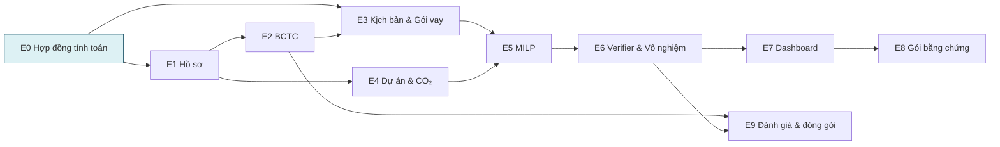

# Epics & Stories — FinESG Planner

## 0. Cách đọc tài liệu này

PRD sở hữu phạm vi và hợp đồng nghiệp vụ. `EXPERIENCE.md` sở hữu bề mặt và hành vi. `ARCHITECTURE-SPINE.md` sở hữu các invariant. Tài liệu này **chỉ** sở hữu thứ tự build và ranh giới story — nó không tạo ra yêu cầu mới. Mỗi story truy về `FR-n`, `AC-n`, `S-n` và `AD-n` đã tồn tại.

Ký hiệu: **[P0]** không được cắt · **[P1]** làm nếu P0 ổn định · 🔒 phase-blocker theo PRD §0.1.

## 1. Bản đồ epic

| Epic | Tên | FR bao phủ | Phụ thuộc |
|---|---|---|---|
| E0 | Hợp đồng tính toán & nền tảng xác định 🔒 | §4.3.1, §4.5.1, NFR-4/6/7/8 | — |
| E1 | Hồ sơ phân tích & mức sẵn sàng | FR-1, FR-2 | E0 |
| E2 | Tiếp nhận BCTC & xác nhận 12 Trường | FR-3..FR-7 | E1 |
| E3 | Kịch bản, Gói vay & giả định 12 tháng | FR-8..FR-11 | E0, E2 |
| E4 | Danh mục Dự án, bằng chứng CO₂ & rủi ro | FR-12..FR-16 | E1 |
| E5 | Bộ giải MILP & ba Chiến lược | FR-17..FR-20 | E0, E3, E4 |
| E6 | Bộ kiểm tra nghiệm, Vô nghiệm & trạng thái | FR-21, FR-22 | E5 |
| E7 | Dashboard, giải thích & so sánh | FR-23..FR-25 | E6 |
| E8 | Gói bằng chứng, Audit Trail & version | FR-26, FR-27 | E7 |
| E9 | Đánh giá nội bộ & đóng gói | FR-28, FR-29 | E2, E6 |

**Vì sao E0 là một epic riêng dù nó không phải "giá trị người dùng".** Nguyên tắc thiết kế epic muốn tổ chức theo giá trị chứ không theo tầng kỹ thuật, và E0 vi phạm nguyên tắc đó một cách có chủ ý. Lý do: PRD §0.1 tự đặt DR-03, DR-07, DR-13, DR-14 và DR-16 làm **phase-blocker trước khi code bộ giải**, và SM-1 (100% golden test) là chỉ số thành công số một. Gộp hợp đồng tính toán vào E3 hoặc E5 sẽ khiến nó được viết *cùng lúc* với UI và bộ giải — đúng cái mà phase-blocker tồn tại để ngăn. E0 cũng là epic duy nhất kiểm chứng được hoàn toàn bằng unit test, không cần DB, HTTP hay bộ giải.

---

## E0 — Hợp đồng tính toán & nền tảng xác định 🔒 [P0]

**Kết quả:** một kernel thuần, đã golden-test, mà E3/E5/E6/E7/E8 đều dựng lên trên. Không có UI.

### E0-S1 — Kiểu đại lượng mang kỳ và số học Decimal

Là một kỹ sư, tôi muốn hệ thống không cho phép cộng hai đại lượng khác kỳ, để lỗi khái niệm trung tâm mà PRD §1.1 mô tả bị chặn ở tầng kiểu thay vì ở tầng review.

**AC:**
- Có các newtype riêng: `LifetimeNPV`, `AnnualFullOperationCO2`, `First12MonthCO2`, `Month12Cash` (AD-21).
- Cộng hai kiểu khác nhau ném lỗi; không có ép kiểu ngầm.
- Mọi tiền/CO₂ là `Decimal` ≥ 6 chữ số thập phân; không `float` trong `domain/` (AD-4).
- Phép toán chạm `None` ném `MissingInputError` kèm mã trường; không có `or 0` (AD-5).

### E0-S2 — Module dung sai duy nhất

**AC:** bốn dung sai §4.5.1 (`τ_binary`, `τ_feasibility`, dung sai tương đối, `τ(z*)`) khai báo một nơi, có version, và persist được nguyên bộ (AD-23).

### E0-S3 — Hợp đồng tính toán 12 tháng

Là CFO, tôi muốn `CashEnd12`, `CFADS12`, `DebtService12`, `DSCR12`, `DebtEnd12`, `DebtToEquity12`, `NPV` và `FinancingCostPV` được tính theo đúng một định nghĩa đã công bố, để kết quả tái lập và giải trình được.

**AC:**
- Toàn bộ bảng công thức §4.3.1 được hiện thực, gồm `Cash_t` theo **từng tháng** chứ không chỉ cuối kỳ.
- `DSCR12` trả `N/A` khi `DebtService12 = 0`, và ràng buộc DSCR không áp dụng; `CFADS12 ≥ 0` vẫn là guardrail độc lập (FR-17).
- `DebtToEquity12` chặn khi `EquityBase ≤ 0` (§4.3.1, State Patterns).
- `NPV_i = Σ_q FCF_i,q / (1+r_i)^(q/12)` tính từ lịch dòng tiền có mốc tháng; NPV người dùng nhập chỉ để đối chiếu (DR-14).
- Hợp đồng mang số version; đổi công thức tạo module version mới (AD-2).

### E0-S4 — Golden test: ví dụ chuẩn và các case biên

**AC:**
- Ví dụ chuẩn §4.3.1 trả **đúng** `CashEnd12=110`, `CFADS12=50`, `DebtService12=20`, `DSCR12=2,5`, `DebtEnd12=95`, `DebtToEquity12=0,95` (§14 tiêu chí 11).
- Fixture bắt buộc: `CashEnd12` dương nhưng một tháng giữa kỳ dưới ngưỡng (§14 tiêu chí 15).
- Fixture biên: nghĩa vụ nợ 12 tháng = 0 · `EquityBase ≤ 0` · trả gốc vượt dư nợ · giải ngân sau CapEx · CapEx sau tháng 12 · dữ liệu `null`.
- Xác nhận SM-1: 100% pass là điều kiện release.

### E0-S5 — Test cưỡng chế invariant

**AC:** CI fail nếu `domain/` import `adapters/`, `sqlalchemy`, `os`, `random` hoặc `datetime.now` (AD-1); CI fail nếu `verify/` import `solve/coefficients` (AD-3).

---

## E1 — Hồ sơ phân tích & mức sẵn sàng [P0]

- **E1-S1** Tạo/sửa/sao chép Hồ sơ với ngành Xi măng|Thép, ngày gốc, kỳ, phạm vi, tiền tệ — FR-1, S01, S02.
- **E1-S2** Ma trận sẵn sàng năm mức tính **chỉ ở server**, trả `ReadinessReport` có blocker + owner + deep-link — FR-2, S03, AD-15.
- **E1-S3** Ngày gốc lệch ngày kết thúc BCTC → Hồ sơ khóa ở mức mô phỏng, có banner giải thích — A15, DR-13, §14 tiêu chí 16.
- **E1-S4** Bốn aggregate version hóa + `expected_version` + 409 kèm diff theo trường — AD-22, AC-09.
- **E1-S5** Envelope lỗi thống nhất + correlation ID + exception handler toàn cục — AD-18, NFR-17/19, AC-17.
- **E1-S6** App shell, process navigation, catalog nhãn + định dạng số — CMP-01, CMP-02, AD-19.

## E2 — Tiếp nhận BCTC & xác nhận 12 Trường [P0]

- **E2-S1** Upload PDF, phân loại text-layer vs scan, lưu hash/số trang/phiên bản; lỗi OCR không tạo số 0 — FR-3, S04.
- **E2-S2** Blob theo khóa `{case_id}/{kind}/{uuid}`, đọc qua endpoint kiểm quyền — AD-24, NFR-9.
- **E2-S3** Job có identity, không tạo job trùng, phục hồi sau điều hướng — FR-3, AD-16, AD-17, CMP-17.
- **E2-S4** Trích đúng 12 trường `FS-01..FS-12` + chuẩn hóa dấu âm/đơn vị/kỳ/phạm vi — FR-4.
- **E2-S5** Provenance bắt buộc, bbox chuẩn hóa một hệ tọa độ, Confidence thấp tự chuyển "Cần kiểm tra" — FR-5, AD-8, CMP-05, CMP-06.
- **E2-S6** Sửa + xác nhận từng trường **và** toàn bộ 12 trường, ghi lý do, khóa phiên bản — FR-6, AC-06.
- **E2-S7** Kiểm tra logic tài chính đầu vào, cho phép đánh dấu ngoại lệ có lý do — FR-7.
- **E2-S8** Trường chưa xác nhận không được dùng trong **bất kỳ** phép tính nào, kể cả mô phỏng — FR-6.

## E3 — Kịch bản, Gói vay & giả định 12 tháng [P0]

- **E3-S1** Ba Kịch bản Thấp/Cơ sở/Cao, sao chép giữ liên kết nguồn, nhãn Ước tính không mất khi sao chép — FR-8, S06, CMP-10.
- **E3-S2** Bảng 12 tháng editable native `<table>`, phân biệt `null`/`0`/`N/A` — FR-8, CMP-07, AC-07.
- **E3-S3** Cấu hình 1–3 Gói vay, lịch giải ngân/trả nợ, điều kiện đủ; chặn gói thứ tư có lý do — FR-9, S07.
- **E3-S4** Khai báo dòng tiền Dự án đã nằm trong dự báo hay chưa; trạng thái không rõ thì chặn tính CFADS — FR-10.
- **E3-S5** Formula disclosure hiển thị cấu thành, đơn vị, kỳ, nguồn — FR-11, CMP-08.
- **E3-S6** Hai tỷ lệ chiết khấu tách biệt (NPV và Chi phí tài trợ) — FR-8, A17, DR-15.

## E4 — Danh mục Dự án, bằng chứng CO₂ & rủi ro [P0]

- **E4-S1** Tối đa 10 Dự án, chặn Dự án thứ 11 có lý do; tạo/sửa/sao chép/bật-tắt/sắp xếp bằng bàn phím — FR-12, AC-12, CMP-12.
- **E4-S2** Tài chính Dự án: CapEx vòng đời / 12 tháng / sau tháng 12, cảnh báo phần chưa kiểm chứng xuyên Dự án → kết quả → preview — FR-12, A11, DR-05.
- **E4-S3** Phiếu bằng chứng phát thải đủ trường bắt buộc, trạng thái bốn mức — FR-13, S10, CMP-13.
- **E4-S4** Cổng CO₂ đã xác nhận; CO₂ mô phỏng chỉ vào chế độ độ nhạy — FR-14, AC-10.
- **E4-S5** Chồng lấn CO₂: chặn tại cổng cho đến khi loại trừ hoặc gộp — FR-13, AD-7, §14 tiêu chí 17.
- **E4-S6** CO₂/năm và CO₂ 12 tháng đầu là hai kiểu, không cộng, không đổi nhãn — FR-13, FR-23, AD-21.
- **E4-S7** Rubric rủi ro năm chiều 0–2, lý do + bằng chứng từng chiều, cờ đỏ loại Dự án — FR-15, CMP-14.
- **E4-S8** Quan hệ bắt buộc / phụ thuộc / loại trừ — FR-16.

## E5 — Bộ giải MILP & ba Chiến lược [P0]

- **E5-S1** `build_run_input` là cổng duy nhất; ném `IneligibleRunError` có mã lý do — FR-17, AD-6.
- **E5-S2** Model MILP: biến `x, u, d, y, h`, cân bằng vốn, toàn bộ ràng buộc bắt buộc FR-17.
- **E5-S3** Big-M suy ra từ cận dữ liệu đã xác nhận, persist vào lần chạy — AD-11.
- **E5-S4** Vòng lặp lexicographic duy nhất chạy mọi tier list; khóa tầng theo `τ(z*)` — AD-9.
- **E5-S5** Ba Chiến lược khai báo dạng dữ liệu; phá hòa xác định là tier bắt buộc — FR-18, FR-19, FR-20, NFR-7.
- **E5-S6** Sắp xếp ổn định trước dựng model; seed/threads/deterministic/time-limit persist — AD-10, NFR-7.
- **E5-S7** Chạy trong worker, đo `solve_seconds` tách khỏi e2e — NFR-1, NFR-2, AD-16.

## E6 — Bộ kiểm tra nghiệm, Vô nghiệm & trạng thái [P0]

- **E6-S1** Verifier đi bộ 12 tháng độc lập, không import hệ số bộ giải, tự suy lại `h` — FR-21, AD-3.
- **E6-S2** Sáu trạng thái bộ giải trình bày tách biệt; chỉ "Tối ưu đã kiểm chứng" được gọi là Phương án tối ưu — FR-21, AC-11, CMP-19.
- **E6-S3** Chẩn đoán Vô nghiệm bằng model slack riêng; `Diagnosis` không bao giờ thành `Plan` — FR-22, AD-12.
- **E6-S4** `constraint_rows` khai báo `basis` (LEDGER | MODEL_SLACK); S14 chỉ render các hàng đó — FR-22, AD-12, CMP-20.
- **E6-S5** Nghiệm trùng gắn nhãn "Cùng Phương án" nhưng giữ Audit Trail riêng — FR-22, §4.5.1.
- **E6-S6** Golden fixture MILP đầy đủ theo §4.5.1 + đối chiếu vét cạn case nhỏ — NFR-5, NFR-6, §14 tiêu chí 12.

## E7 — Dashboard, giải thích & so sánh [P0]

- **E7-S1** Result metric group tách vòng đời / 12 tháng / vốn-nợ / CO₂ / rủi ro, mọi số có đơn vị + kỳ + phiên bản — FR-23, CMP-21, AC-18.
- **E7-S2** Không có điểm tổng hợp; biểu đồ luôn có bảng dữ liệu tương đương; cấm pie/radar — FR-23, CMP-24.
- **E7-S3** Lý do chọn/loại từng Dự án, ít nhất một lý do thuộc logic mô hình — FR-24, CMP-22.
- **E7-S4** So sánh Chiến lược chỉ trong cùng phiên bản; khác phiên bản chuyển "So dữ liệu" — FR-23, CMP-23, S16.
- **E7-S5** Kết quả lỗi thời xem được nhưng chặn chọn cuối và chặn xuất như kết quả hiện hành — AC-09, State Patterns.
- **E7-S6** [P1] So sánh độ nhạy tự động — FR-25, S17, OF-1.

## E8 — Gói bằng chứng, Audit Trail & version [P0]

- **E8-S1** Gói bằng chứng PDF đủ tám section + cảnh báo CapEx sau tháng 12 — FR-26, AC-14.
- **E8-S2** Báo cáo chẩn đoán có watermark cho "Khả thi chưa chứng minh tối ưu", không mở quyền chọn cuối — AC-13.
- **E8-S3** Chọn Phương án cuối và Xuất là hai hậu quả riêng, mỗi cái một idempotency key — CMP-25, AD-17, AC-05.
- **E8-S4** Audit event ghi cùng transaction; `REVOKE UPDATE, DELETE` trên bảng version và audit — FR-27, AD-13, AD-14.
- **E8-S5** Audit timeline lọc theo đối tượng/người/lần chạy, deep-link bản read-only — FR-27, S19, CMP-26.
- **E8-S6** Số hiển thị trên PDF và trên màn hình dùng chung quy tắc định dạng — AD-19.

## E9 — Đánh giá nội bộ & đóng gói [P0 trừ nơi ghi P1]

- **E9-S1** `data_inventory.csv` hợp lệ: SHA-256 trống thì tập kiểm tra là "Không hợp lệ" và **không** tính Precision — FR-28, QA-1, AC-16.
- **E9-S2** Báo cáo chất lượng trích xuất **trước** khi Kế toán sửa: số đúng/tổng, Precision, tỷ lệ tự xử lý, tỷ lệ Cần kiểm tra, cỡ mẫu — FR-29, SM-6.
- **E9-S3** Tuyên bố hạn chế: 8 BCTC chỉ là smoke test, không dùng để tuyên bố tổng quát hóa — FR-29, SM-8.
- **E9-S4** Docker Compose bốn service, tessdata bake vào image, runtime không có outbound network — §9.1, AD-17.
- **E9-S5** Luồng bàn phím và zoom 200%/400% đến 320px cho UJ-1..UJ-6 — AC-01, AC-02, NFR-15.
- **E9-S6** [P1] Dashboard chất lượng trích xuất — X-A4.

---

## 2. Đối chiếu bao phủ

| FR | Epic | FR | Epic | FR | Epic |
|---|---|---|---|---|---|
| FR-1 | E1 | FR-11 | E3 | FR-21 | E6 |
| FR-2 | E1 | FR-12 | E4 | FR-22 | E6 |
| FR-3 | E2 | FR-13 | E4 | FR-23 | E7 |
| FR-4 | E2 | FR-14 | E4 | FR-24 | E7 |
| FR-5 | E2 | FR-15 | E4 | FR-25 | E7 |
| FR-6 | E2 | FR-16 | E4 | FR-26 | E8 |
| FR-7 | E2 | FR-17 | E5 | FR-27 | E8 |
| FR-8 | E3 | FR-18 | E5 | FR-28 | E9 |
| FR-9 | E3 | FR-19 | E5 | FR-29 | E9 |
| FR-10 | E3 | FR-20 | E5 | | |

29/29 FR có epic sở hữu. §4.3.1 và §4.5.1 — hai hợp đồng không mang số FR nhưng là phase-blocker — thuộc E0 và E5/E6.

## 3. Thứ tự cắt khi trễ tiến độ

Theo PRD §9.2, không thay đổi: (1) mở rộng 20–30 BCTC → (2) E9-S6 dashboard đánh giá → (3) xuất CSV/JSON → (4) E7-S6 độ nhạy tự động → (5) điều hướng riêng theo vai trò.

**Không bao giờ cắt:** E0 toàn bộ · cổng Provenance/human-review của E2 · cổng CO₂ đã xác nhận của E4 · ba Chiến lược của E5 · Bộ kiểm tra nghiệm của E6 · nhãn Sàng lọc mô phỏng · cảnh báo tài trợ sau tháng 12 · Audit Trail tối thiểu.
